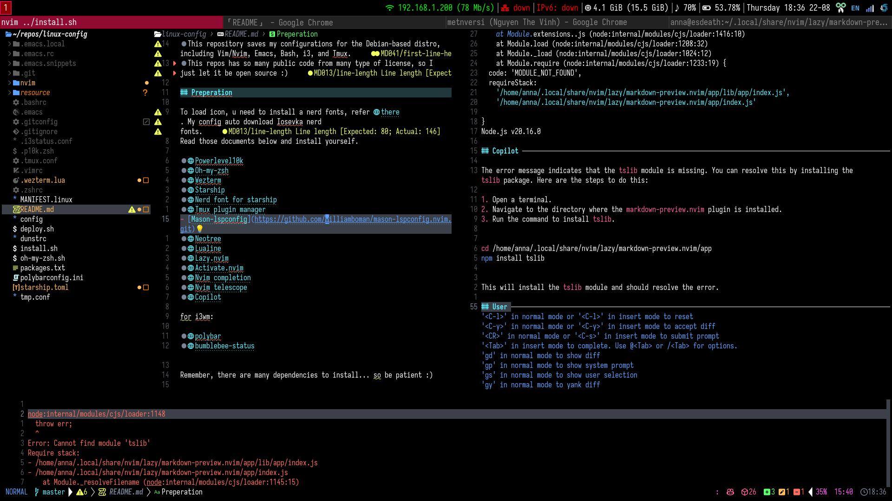

- This repository saves my configurations for the Debian-based distro, including Vim/Nvim, Emacs, Bash, i3, and Tmux.
- This repos has so many public code from many type of license, so I just let it be open source :)

## Preperation

To load icon, u need to install a nerd fonts, refer [there](https://www.nerdfonts.com/font-downloads). My config auto download Iosevka nerd fonts.
Read those documents below and install yourself.

- [Powerlevel10k](https://github.com/romkatv/powerlevel10k.git): my theme for zsh
- [Oh-my-zsh](https://github.com/ohmyzsh/ohmyzsh.git): manage themes in zsh
- [Wezterm](https://wezfurlong.org/wezterm/installation.html): imgcat + better custom appearance terminal
- [Starship](https://github.com/starship/starship.git): theme for bash/zsh. 
- [Nerd font](https://www.nerdfonts.com/font-downloads): also require for every theme icon
- [Tmux plugin manager](https://github.com/tmux-plugins/tpm.git): tmux manager, as the name :)
- [Mason-lspconfig](https://github.com/williamboman/mason-lspconfig.nvim.git)
- [Neotree](https://github.com/nvim-neo-tree/neo-tree.nvim.git)
- [Lualine](https://github.com/nvim-lualine/lualine.nvim.git)
- [Lazy.nvim](https://lazy.folke.io/)
- [Activate.nvim](https://github.com/roobert/activate.nvim)
- [Nvim completion](https://github.com/hrsh7th/nvim-cmp)
- [Nvim telescope](https://github.com/nvim-telescope/telescope.nvim)
- [Copilot](https://github.com/github/copilot.vim.git)
- [Copilot Chat](https://github.com/CopilotC-Nvim/CopilotChat.nvim): require paid license

for i3wm:

- [polybar](https://github.com/polybar/polybar)
- [bumblebee-status](https://github.com/tobi-wan-kenobi/bumblebee-status.git)

Remember, there are many dependencies to install... so be patient :)

## Deployment

```Bash
git clone https://github.com/metnversi/linux-config.git
cd linux-config
./deploy.sh
```

## Some pictures




Worked on my machine :D
