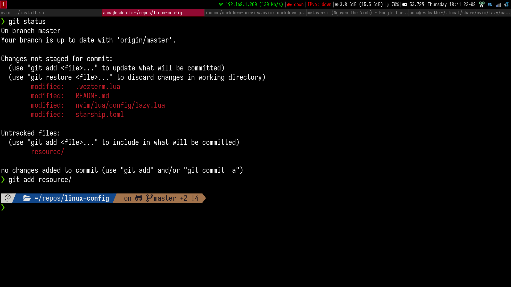

To load icon, u need to install a nerd fonts, refer [there](https://www.nerdfonts.com/font-downloads). My config auto download Iosevka nerd fonts.
Read those documents below and install yourself.

- [Powerlevel10k](https://github.com/romkatv/powerlevel10k.git): my theme for zsh
- [Oh-my-zsh](https://github.com/ohmyzsh/ohmyzsh.git): manage themes in zsh
- [Wezterm](https://wezfurlong.org/wezterm/installation.html): imgcat + better custom appearance terminal
- [Starship](https://github.com/starship/starship.git): theme for bash/zsh.
- [Nerd font](https://www.nerdfonts.com/font-downloads): also require for every theme icon
- [Tmux plugin manager](https://github.com/tmux-plugins/tpm.git): tmux manager, as the name :)

